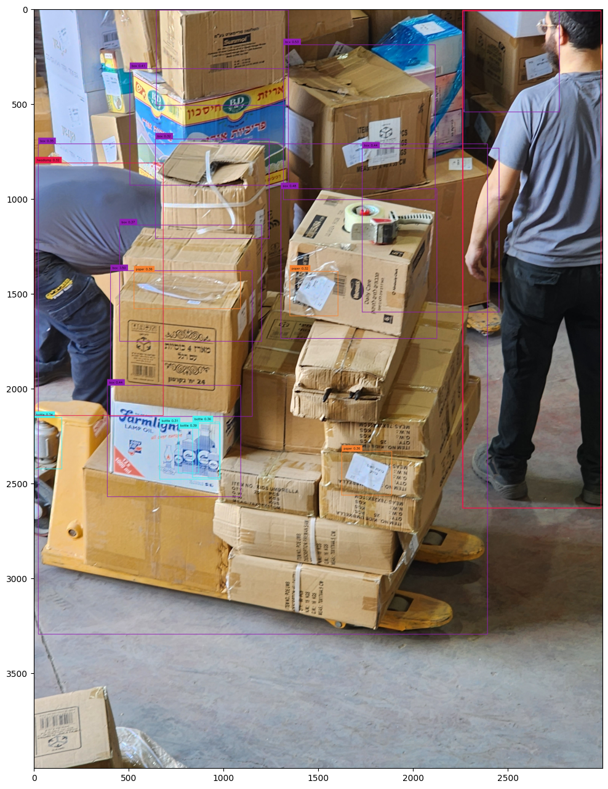

## GroundingDINO_Object_Counter
## Table of Contents

- [Objective](#langchain-medical-bot)
- [Configuration](#table-of-contents)
- [Output images](#prerequisites)
- [Steps in this Tutorial](#installation)
- [Dataset Link](#getting-started)
- [Contributing](#contributing)
- [License](#license)

### Objective
Count the number of occurrences of various objects in single or multiple images, leveraging the capabilities of GroundingDINO. This extension enhances GroundingDINO's usability by incorporating object counting functionality, providing a total count of detected items.

### Configuration
  * CLASSES - Classes to detect in images (*Modify the items in the CLASSES list to detect different objects*)  
              * ['headlamp', 'men underwear', 'book', 'candy', 'paper', 'box', 'bottle']
              

* BOX_THRESHOLD - 0.30
  (*bounding box detection*)

* TEXT_THRESHOLD - 0.20
  (*threshold for text detection*)

### Output images

1. **Object Counting On Single Image (Sample):**
   

   

  
##### Results for 20231121_121427.jpg: 
- headlamp: 3
- men underwear: 0
- book: 0
- candy: 0
- paper: 3
- box: 11
- bottle: 4

### Pro Tip: Use GPU Acceleration - Google Colab T4 GPU

## Steps in this Tutorial

In this tutorial, we are going to cover:

- **Before you start** - Make sure you have access to the GPU
- **Install Grounding DINO** - Setup Python environment.
- **Mount Example Data from Google Drive**
- **Load model**
- **Single Image Inference**
- **Multiple Image Inference**
---
### Dataset Link - Request to author
Credits - Inspired from [RoboFlow](https://github.com/roboflow/notebooks/tree/main/notebooks) GroundingDINO notebooks
- Research articles
   * [GroundingDINO Paper](https://arxiv.org/abs/2303.05499)
   * [Exaplanations](https://www.ikomia.ai/blog/grounding-dino-zero-shot-detection-explained)

 

Grounding DINO can detect **arbitrary objects** with human inputs such as category names or referring expressions. The key solution of open-set object detection is introducing language to a closed-set detector DINO. for open-set concept generalization. If you want to learn more visit official GitHub [repository](https://github.com/IDEA-Research/GroundingDINO) and read the [paper](https://arxiv.org/abs/2303.05499).

### Contributing

Contributions to the GroundingDINO Object Counter are welcome! If you'd like to contribute to the project, please follow these steps:

1. Fork the repository to your own GitHub account.

2. Create a new branch for your feature or bug fix.

3. Make your changes and ensure that the code passes all tests.

4. Create a pull request to the main repository, explaining your changes and improvements.

5. Your pull request will be reviewed, and if approved, it will be merged into the main codebase.

### License

This project is licensed under the MIT License.

---

For more information on how to use, configure, and extend the GroundingDINO Object Counter, please refer to the GroundingDINO paper and Roboflow notebooks or contact the project maintainer.

Happy coding with GroundingDINO_Object_Counter! 🚀

